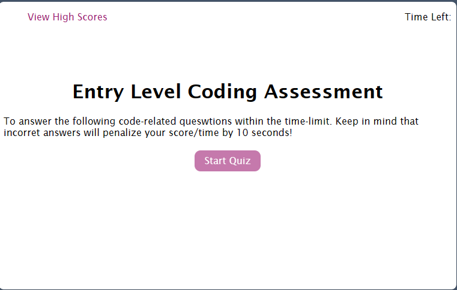

# Coding_Assessment

## Mini, self-study tool for learning JavaScript

AS A coding boot camp student
I WANT to take a timed quiz on JavaScript fundamentals that stores high scores
SO THAT I can gauge my progress compared to my peers

## Installation
Accessible through web URL. No need to install the application.

## Usage
Upon site navigation, the user is presented with quiz instructions and a "start quiz" button.
When start button is clicked, user has 75 seconds to complete the 5 question quiz.
Each wrong answer will deduct 10 seconds from time as a penalty.
When the time runs out or all 5 questions have been answered, the page will display your final score and ask for user input of initials.
User will have the option to retake the quiz.
    

## Credits
University Tutors: Alistar Rowden & Bootcamp Services: XpertLearningAI

## License
n/a
